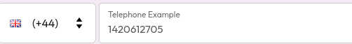

Attribute Type Reference
========================

This page contains a list of the base types for dynamic attributes, as well as
details of each possible input controls,capabilities, and options.

:::note Defaults
Not all systems support all input types. In cases where a particular input type
isn't supported, the default input for the given attribute type will be used.
:::

## Text Attributes

Text attributes will default to [Single-Line Text](#single-line-text) if no
enhanced type is specified.

### Single-Line Text

A plain, single-line text box.


### Multi-Line Text

A multi-line text box with a configurable number of lines.


### Telephone

A special-purpose text field for entering a phone number, stored value for this
field will always be consistently formatted as [E.164][wiki:e.164] format. (e.g
`+441420612705`). The displayed value will be formatted based on the country
dialling code.



[wiki:e.164]: https://en.wikipedia.org/wiki/E.164

### Transport

A special-purpose input for entering a transport itinterary (such as flights),
allowing multiple segments to be input with departure and arrival locations and
times, along with route numbers and transport modes.

The value stored for this field type will be an ordered list of segments
formatted as a table of fields separated by the `|` character as follows:

```
Mode | Route/Flight/Train Number | Departure Time | Departing From | Arrival Time | Arrival Location
```

For example, a British Airways flight from Heathrow and a returning American flight to Los Angeles:

```
Flight | BA281 | 2025-04-23T11:40:00+0100 | London Heathrow (LHR) | 2025-04-23T14:55:00-0700 | Los Angeles International (LAX)
Flight | AA136 | 2025-04-30T13:20:00-0700 | Los Angeles International (LAX) | 2025-05-01T08:00:00+0100 | London Heathrow (LHR)
```


## Selection Attributes

Depending on the validation rules, a selection attribute will use either a
[drop-down](#drop-down-selection), when only one option can be selected, or a [checkbox group](#checkbox-group), if
multiple options can be selected.

### Checkbox Group

A set of checkboxes from which the user can pick the desired number of options.

### Radio Group

A set of radio inputs from which the user can pick one option.

### Drop-down Selection

A drop-down menu of options from which the user can pick one option.


## Numeric attributes

Numeric attributes use [number entry](#number-entry) by default.


### Number Entry

A simple text box which allows only number values.

### Number Stepper

A text box which allows only number values, with buttons to increase or decrease
the value. The amount by which the buttons change the value is determined by the
`precision` validation rule.

